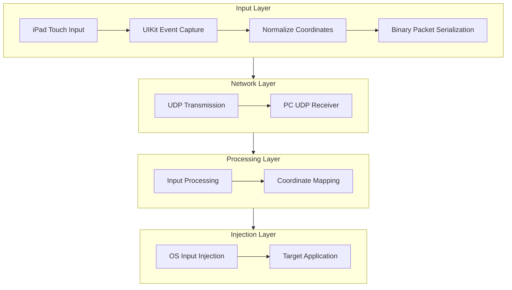

# System Architecture
## iPad Application (Swift)
Built with:
- Swift (we have to)
- Xcode, Apple IDE
- UIKit (touch input handling)
### Responsibilities
- Capture touch input (hand and Apple Pencil)
- Normalize coordinate
- Encode input as binary packets
- Transmit packets via UDP
### Constraints
- No background execution
- No system-level input injection
- Sandboxed execution environment
## PC Application (C++)
Build with:
- C++17+
- VSCode
- WinSock (networking)
- Wiin32 API (input injection)
### Responsibilities
- Receive UDP packets
- Decode binary protocol
- Map coordinates to screen space
- Inject input into OS (mouse or virtual tablet)
# Data Flow
